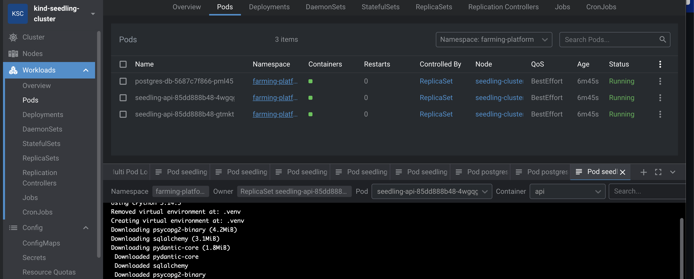
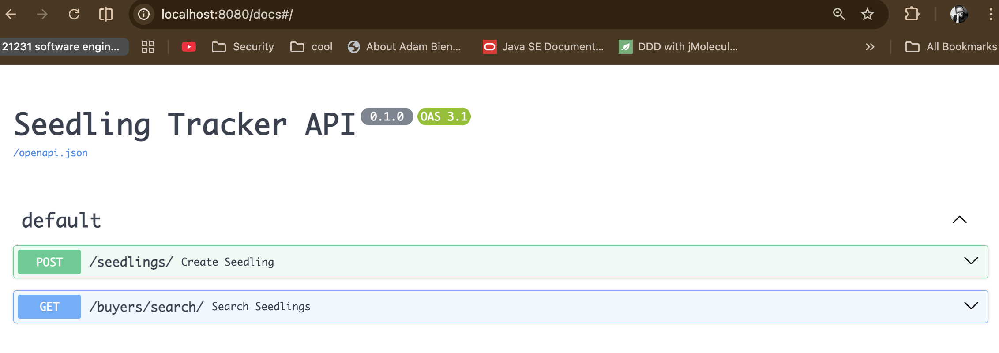

## Some notes
`Readiness Probe` - If the app takes 10 seconds to connect to the database on startup, the Readiness probe prevents Kubernetes from sending users to the pod until it's actually ready. Without this, users see 502 Bad Gateway during a rollout.

`Liveness Probe` -  If the app freezes (deadlock), this probe will fail, and Kubernetes will automatically kill and restart the pod for you. It's self-healing.

## port forwarding
```bash
kubectl port-forward svc/api-service 8080:80 -n farming-platform

#test
http://localhost:8080/docs

#see logs
kubectl logs -f -l app=seedling-api -n farming-platform

# scaling
kubectl scale deployment/seedling-api --replicas=5 -n farming-platform

```


## Useful commands + troubleshooting
```bash
docker build -t seedling-api:latest .
kind create cluster --name seedling-cluster

#Checking info
kubectl cluster-info --context kind-seedling-cluster


kind load docker-image seedling-api:latest --name seedling-cluster
terraform init
terraform apply

#getting info about deploment
$ kubectl get pods -n farming-platform -w
NAME                            READY   STATUS    RESTARTS   AGE
postgres-db-5687c7f866-pml45    1/1     Running   0          8m56s
seedling-api-85dd888b48-4wgqg   1/1     Running   0          8m56s
seedling-api-85dd888b48-gtmkt   1/1     Running   0          8m56s


# Developing
# After applying deployment
kubectl rollout restart deployment seedling-api -n farming-platform

#Delete recreate 
terraform apply -replace="kubernetes_deployment.api"


# cleaning
cd infra/k8s-kind
# 1. Destroy Terraform managed resources
terraform destroy -auto-approve
# or
rm -f terraform.tfstate terraform.tfstate.backup .terraform.tfstate.lock.info
terraform init

kind delete cluster --name seedling-cluster

# 1. Recreate the cluster
kind create cluster --name seedling-cluster
# 2. Build your app image from the backend root
# Ensure your Dockerfile now uses 'app.main:app'
docker build -t seedling-api:latest .
# or check here if exists
docker exec -it seedling-cluster-control-plane crictl images
# 3. Load the image into the new cluster
kind load docker-image seedling-api:latest --name seedling-cluster
terraform apply
# or
terraform apply -lock=false


# Kill zombie Terraform processes
# any hunging
killall terraform 2>/dev/null
rm -rf .terraform
rm .terraform.lock.hcl
terraform init
terraform apply -auto-approve


# finally scaling down
kubectl scale deployment seedling-api --replicas=0 -n farming-platform


# since db is a seperate deployment
$ kubectl get deployments -n farming-platform
NAME           READY   UP-TO-DATE   AVAILABLE   AGE
postgres-db    1/1     1            1           44m
seedling-api   0/0     0            0           44m

# scale to 0
kubectl scale deployment postgres-db  --replicas=0 -n farming-platform
```



